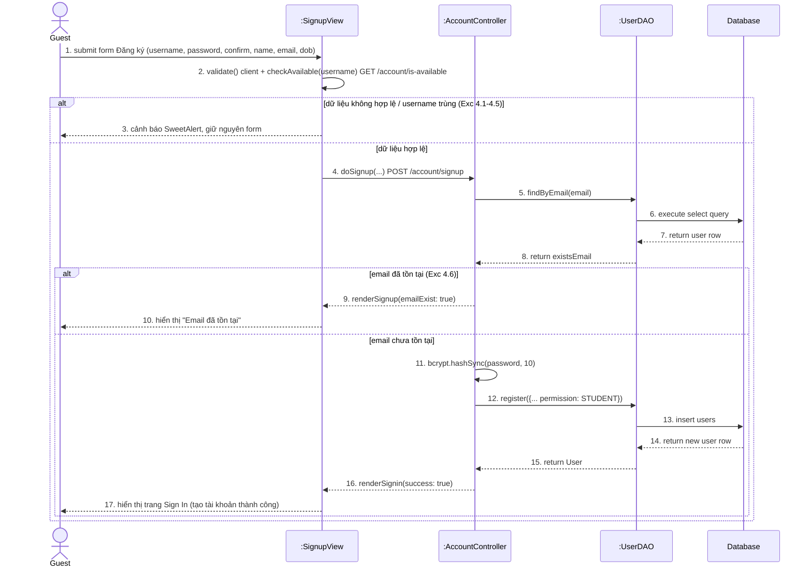
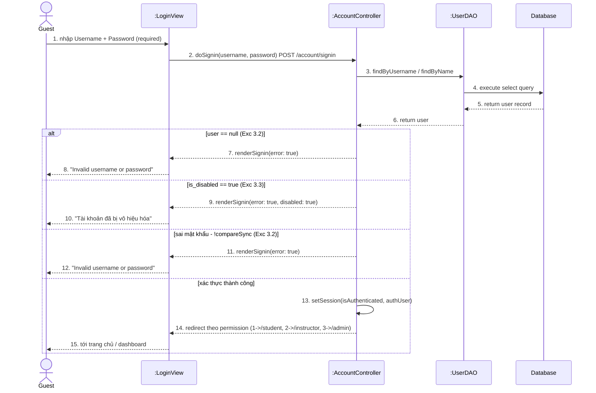

# Sequence Diagram (Mermaid) — Register & Login

Bản Mermaid render trực tiếp trên GitHub, nội dung **đồng nhất** với file drawio
(`diagrams/SequenceDiagram.drawio`). Dùng để đối chiếu nhanh khi ôn tập.
Phiên bản này **không dùng OTP** — đăng ký xong tạo tài khoản ngay.

## UC01 Register — Đăng ký (`doSignup`)

## UC02 Login — Đăng nhập (`doSignin`)

